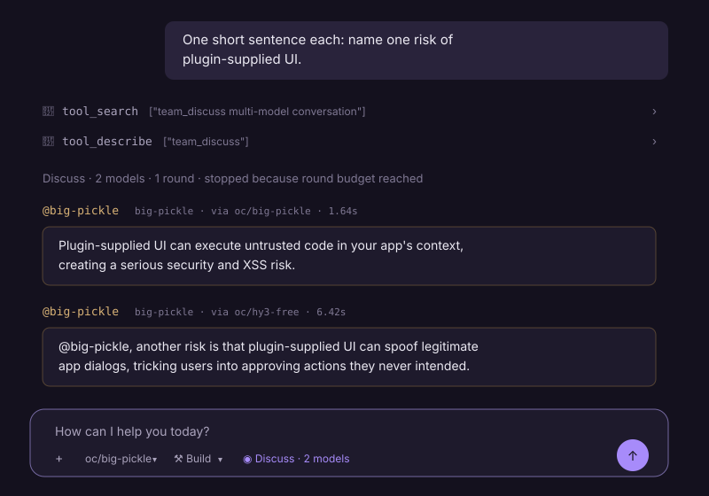
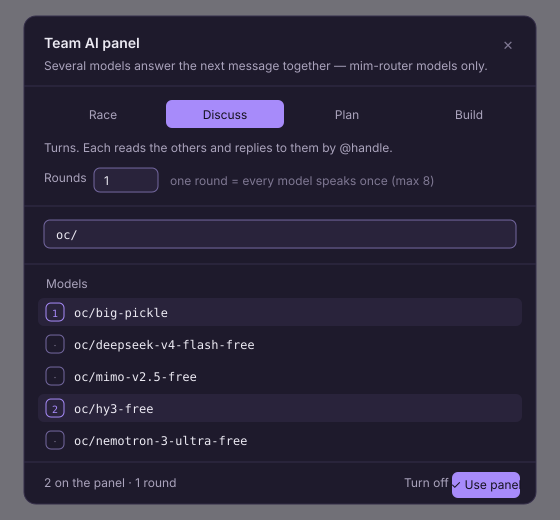

# team_ai

Put several models on one message — racing, or talking to each other — from
the Hermes chat composer.

A Hermes Agent plugin. It ships both halves: four tools for the agent, and a
dashboard surface so a person can pick who is on the panel without describing
it in prose and hoping the agent guessed the same model ids.





> The two images are renderings of the live UI, drawn from it rather than
> captured from it — the tooling used to build this plugin cannot save a PNG
> out of a browser. Text, colours, spacing and the model names are the real
> ones from the run shown. Replace them with a real screenshot if you prefer;
> nothing else references the files.

## What it does

Four tools, one primitive. Every one names its models explicitly — nothing is
called that you did not list, because a panel that quietly fans out to every
model you have configured is a bill you did not agree to.

| tool | shape |
|---|---|
| `team_race` | all at once; first usable answer wins, the rest are cancelled. An empty reply does not win |
| `team_discuss` | turns. Each model reads the transcript and answers peers by `@handle`, until the panel converges or the round budget runs out |
| `team_plan` | same turn-taking, different brief: ordered steps, challenged, with risks named. No implementation |
| `team_build` | one drafts the artifact whole; later turns quote the part they are changing and say what was wrong with it |

The agent can call these on its own. The dashboard control is for when *you*
want to choose.

## Install

```bash
# from the Hermes dashboard: Plugins → Install → paste the repo
buildwishes-art/hermes-team-ai
```

or clone it into your Hermes home:

```bash
git clone https://github.com/buildwishes-art/hermes-team-ai "$HERMES_HOME/plugins/team_ai"
```

Then enable the toolset in `config.yaml` and restart the backend:

```yaml
plugins:
  enabled:
    - team_ai
```

A restart is required either way — the dashboard plugin list is discovered once
per process, and the Python tools are registered at agent construction.

## Requirements

- **Hermes Agent** with the dashboard plugin system
- **Plugin SDK 1.2.0+** for the composer control. Below that the dashboard has
  no send-transform API, so the control could render and change nothing — it
  refuses to register at all and says why in the console, rather than giving
  you a switch wired to nothing
- **Plugin SDK 1.3.0+** for the panel bubbles. Without it everything still
  works; panel results just render as the built-in one-line tool row
- A provider that serves every model you put on a panel (see *Limits*)

`hermes-web-remake` is the reference host — it carries both extension points.

## How the composer control works

Arming the panel does not send anything by itself. On your next message the
plugin rewrites it into an explicit request:

```
Run this through the model panel. Call the `team_discuss` tool exactly once, with:
  models: ["oc/big-pickle","oc/hy3-free"]
  rounds: 1
  question: everything below the --- line, verbatim

Do not answer it yourself first, do not substitute other models, and do not
call the tool a second time. After it returns, add at most two sentences of
your own.

---
<your message>
```

**This asks for the panel; it does not force it.** `prompt.submit` carries
text, and there is no `tool_choice` on that path — the only thing that can
invoke a tool is the agent. Stating the call in full is the honest version of
that, and it stays visible to the model rather than happening behind it. If
the `team_ai` toolset is off, the tool does not exist and the agent will simply
answer by itself.

Your own text sits below the rule rather than inside the instructions, so a
question containing the word `models:` cannot be read as an argument.

### Order is turn order

Selected models show a position, not a tick. In a discussion, `1` speaks first.

### Combos are listed apart

A `combo/…` id is a routing rule, not a speaker. The bubble header credits the
model that actually answered and keeps the alias on a `via` line, so a
combo-routed panel stays auditable — and two panelists behind one combo do not
end up sharing a handle.

## Limits

- **One provider per panel.** `panel.py` calls `async_call_llm(model=…)` with
  no provider override, so every id is resolved against the base_url the
  session is already using. A model borrowed from another provider is posted to
  the wrong endpoint and fails in a way that looks like the model's fault.
- **A panel costs what it costs.** `team_discuss` with 3 models and 3 rounds is
  up to nine completions for one message. Rounds are capped at 8.
- **A failing panelist does not stop the panel.** It is recorded and skipped
  for that round; the failures are shown under the bubbles rather than dropped,
  so a two-model panel that answered once does not read as a one-model panel.

## Layout

```
plugin.yaml            # Hermes plugin manifest — tools, not UI
__init__.py            # tool schemas and argument handling
panel.py               # the race / turn-taking mechanics
dashboard/
  manifest.json        # dashboard plugin manifest — slots, entry
  dist/index.js        # the UI. Hand-written, no build step
```

`dist/index.js` is deliberately not bundled. The host exposes React and its
helpers on `window.__HERMES_PLUGIN_SDK__`, so there is nothing to compile and
no second copy of React to keep in step with the host's.

## License

MIT — see [LICENSE](LICENSE).
